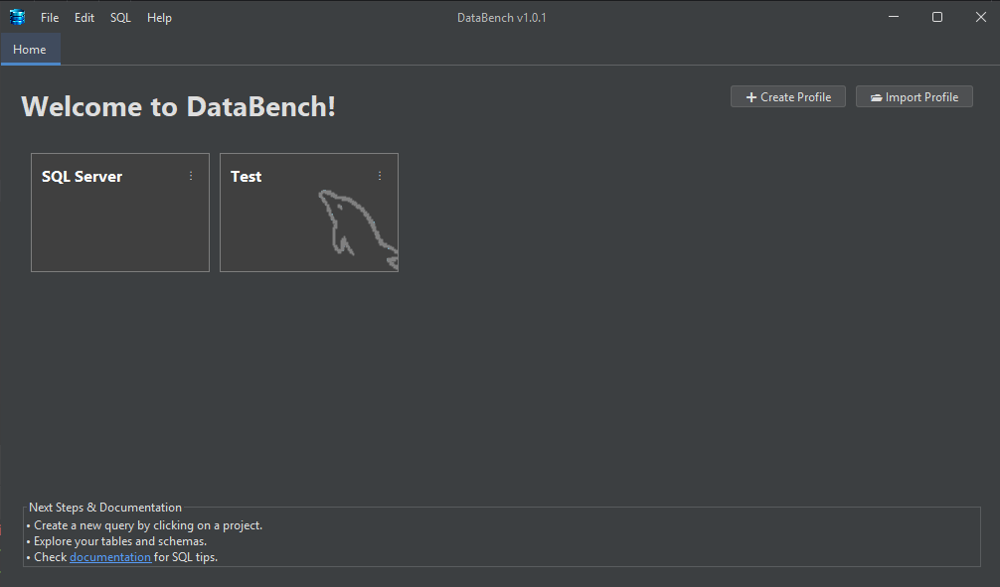
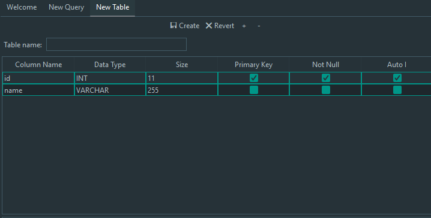
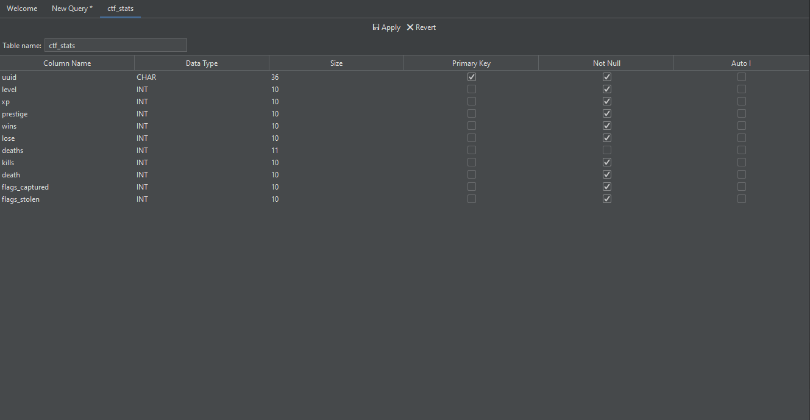
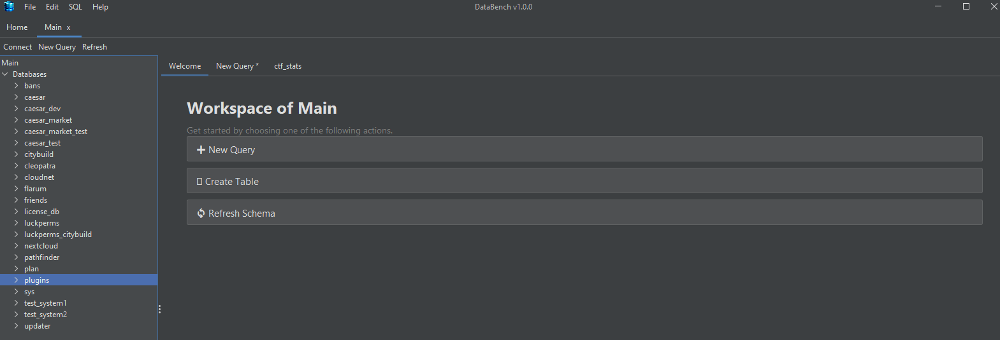
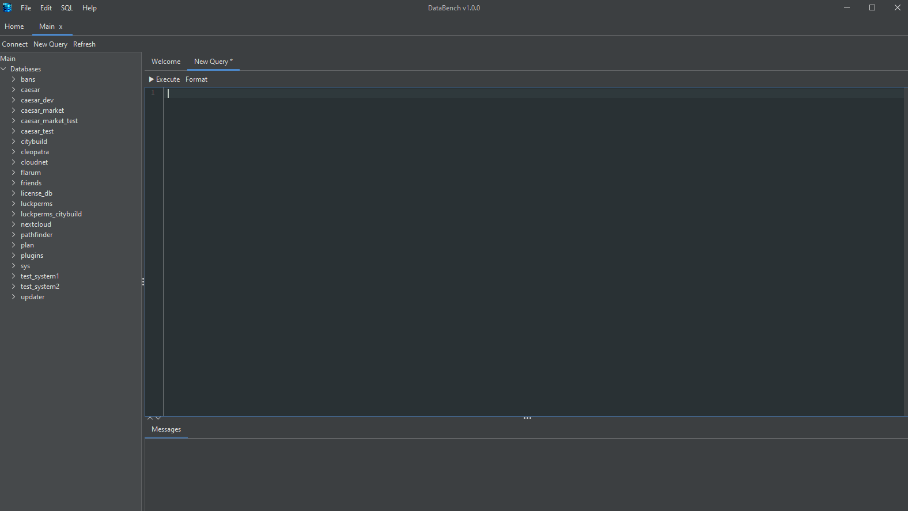

 

# 💾 DataBench

Databench is an open-source software tool designed to help users manage and analyze their databases, no matter which engine.

## 🔒 Features
- 😊 User-friendly interface for managing databases
- 🚀 Integrated SQL editor with **syntax highlighting** and **auto-completion**
- 🏣 Support for multiple database connections
- 🗯 Support for different database types (MySQL, MariaDB, SQL Server, PostgreSQL built-in, more are available through plugins)
- 🏛️ Native Windows authentication support for SQL Server
- 🌜 Dark Mode support for comfortable coding
- 📤 Export query results to CSV/MS Excel format
- ⚙️ Lightweight and easy to install
- 🔒 Secure and encrypted database connection details to share with team members
- 🐳 Advanced plugin system to integrate into events, change ui elements, implement new database types, add themes and more
- 📫 Data import/export functionality (WIP; Proof of concept)
- 🌊 Flow: An SQL Agent alternative for every database engine

<!-- 
TODO Future features:
- 🖼️ Visual query builder for creating complex queries without writing SQL code
- 🖨️ Database schema visualization
- 🔓 Easily work together with team members with live collaboration features
-->

## ⚙️ How to Install
**Download the latest release from the [GitHub Releases](https://github.com/JWeinelt/DataBench/releases) page.**

Download the appropriate version for your operating system (Windows, macOS, or Linux) and follow the installation instructions provided.

## 🚀 Getting Started
1. Launch DataBench after installation.
2. Set up an encryption password for securing your database connections.
3. Add a new database connection by providing the necessary details (host, port, username, password, database name).
4. Start managing and analyzing your databases using the intuitive interface.

## 🖼 Screenshots
*These screenshots were taken with the material UI theme*

